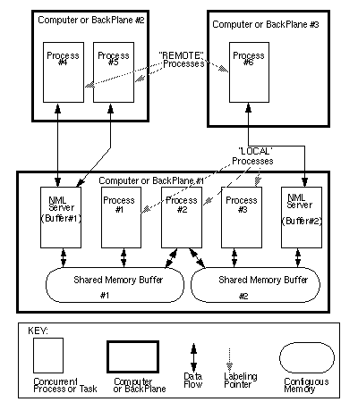
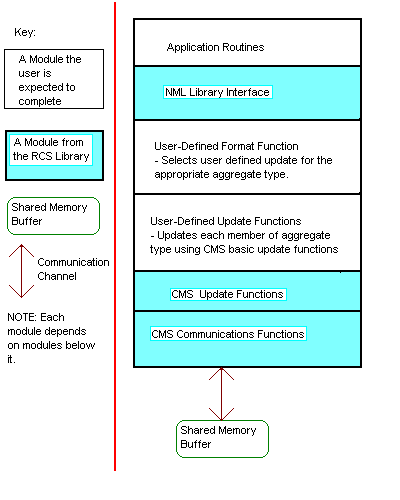

# RCS框架介绍和使用

## 介绍

官网：[地址](https://www.nist.gov/el/intelligent-systems-division-73500/networked-control-systems-group/real-time-control-systems)

全称为Real-Time Control Systems Library，是一种模块之间的实时通信系统，该系统库由美国国家标准与技术研究院（NIST）提供研发与技术支持，适用于自动驾驶等复杂系统的模块化开发应用

其中的通信管理系统（Communication Management System，CMS）提供多个进程在同一个处理器上在背板上或者网络中读写固定大小缓冲区的功能。不管通信方式如何，接口是统一的。数据通过C类型编码方式存储在独立的机器上或者使用中性的格式，返回本地格式。CMS_HEADER添加到每个缓冲区，记录着缓冲区是否被写或者最后被读取，是否对于某个进程来说是新的，最后一次写入的大小。CMS使用配置文件使得使用者不需要重新编译链接程序来改变通信协议。

中性消息语言（Neutral Message Language，NML），通常被认为是中性制造业语言，提供了高层次接口给CMS，提供了处理多种消息类型在同一个缓冲区的同时简化了缓冲区编码解码成中性格式的接口和配置机制。

最新的源码可以在NIST的github项目中找到：[地址](https://github.com/usnistgov/rcslib)

## 准备工作

安装open-jdk

从github克隆代码

## 编译

```bash
./configure --enable-ALLJAVA
make -j
sudo make install
```

## 详细介绍

https://www.nist.gov/el/intelligent-systems-division-73500/networked-control-systems-group/nml-programmers-guide-c

下图是RCS应用使用NML的结构



应用分布在三个计算机上。进程1，进程2，进程3可以直接写共享内存缓冲区，因为它们在同一台计算机或者背板上。因为这个原因它们被标记为“LOCAL”。进程4、5和6只能通过NML服务器来访问缓冲区，因此被标记为“REMOTE”，这个描述在不止一台机器的时候可能会变得复杂。对于一个缓冲区来说进程需要描述为本地或者远程

对于需要远程进程访问的每个缓冲区都需要运行NML服务器，他们和本地进程一样的方式代表远程进程对缓冲区进行读写

NML使用配置文件存储哪个进程和哪个缓冲区交互、怎样进行交互。大部分选项都在配置文件中。[写配置文件教程](https://www.nist.gov/el/intelligent-systems-division-73500/networked-control-systems-group/writing-nml-configuration)

NML是基于消息而非基于流。每一次成功的读操作检索的数据都是一次写操作，除非允许队列，每一次写操作都移动一条消息到缓冲区替代之前的消息

不止一种类型可以送往同一个缓冲区所以在消息中包含唯一标识，读完后在使用前需要使用该标识判断数据的类型，每一种消息对应一种特定的结构，大多数消息是用户定义的

如果消息被翻译成与机器无关的或者中性格式——例如eXternal Data Representation (XDR)，被称作为编码。如果缓冲区根据配置文件编码，被称为编码。NML服务器能够代替远程进程对消息编码解码。NML词汇表定义了可在应用程序中使用的消息集，并提供了用于编码和解码消息的必要功能

```
Header File

All of the necessary header files will be included if rcs.hh is included.

Classes

The following classes provide the programming interface for CMS and NML:

NML
NMLmsg
NML_SERVER

CMS
CMS_HEADER
CMS_SERVER

CMS_USER
```

以下介绍这些类别的详细内存

以下图表示了单并发进程模块NML结构




因为NML是可配置的，所以程序员可以在具有更高性能但可能更具限制性或需要更昂贵的硬件的协议之间进行选择，或者可以是限制性较小或需要更便宜的更广泛使用的硬件的协议。通过将缓冲区设置为本地进程，可以提高该进程的性能。通过移动进程，您可能能够减少一个CPU的负载或增加能够使用更快的本地协议的进程的数量。使用服务器提供对缓冲区的远程访问可以使本地进程免于与远程进程的通信而减慢速度。

## 设计NML应用程序

### 设计建议总结

1. 避免给CPU分配过多的进程或者让单一的一个进程做过多的工作
2. 放置缓冲区使得时间紧迫的进程能够本地获取
3. 尽可能使用LOCAL协议
4. 仅在必要的时候使用中性缓冲区编码（比如不同处理器背板通信）或者动态大小的缓冲区

## 使用NML进行编程

NML应用程序程序员需要创建消息词汇表和关联的格式函数，编写配置文件，创建NML对象以及使用读写成员函数。

### 创建NML词汇表（格式函数，更新函数和消息定义）

消息词汇表是一系列的C++类，从NML消息衍生而来，可以理解为从NML缓冲区读的时候拷贝出来，写的时候拷贝进去的数据结构。每个类都有一个唯一标识关联，一个正整数，允许读取的人能够通过标识判断数据类型。除了数据成员外，每个类需要一个`update`函数调用CMS函数把数据成员转换为CMS能够处理的类型。目前提供了一些内建的基础数据类型。`long long` 和`unsigned long long`不是标准的内建类型不支持。需要注意[NML64位long](https://www.nist.gov/el/intelligent-systems-division-73500/networked-control-systems-group/nml-64bit-long-notes)，在假设`long`和`unsigned long`为32位或者64位时，或者假设`long double`超过64位时。

为了使CMS能够中性地格式化缓冲区中的数据，或者允许NML服务器对远程进程的数据进行编码和解码，需要使用格式化函数。这个格式化函数就是一个switch语句，根据类的唯一标识来更新特定的NML消息类，格式化函数可以自己手动编写也可以使用NML Code Generator

### 可变长度数组

一些高级的使用者使用变长数组定义消息。有很多办法可以实现，最简单方便的办法就是使用`DECLARE_NML_DYNAMIC_LENGTH_ARRAY`宏，这个宏对于NML Code Generator有特定的意义。结果是产生一个数组，该数组具有恒定的最大大小，但每次远程读取或写入时，仅前面的`name_length`代表的个数的元素通过网络发送。

这个宏为

```c++
#define DECLARE_NML_DYNAMIC_LENGTH_ARRAY(type, name, size) int name##_length; type name[size]; 
```

### 示例：消息定义

```c++
/* nml_ex1.hh */
#ifndef NML_EX1_HH
#define NML_EX1_HH
#include "rcs.hh"
/* Give the new structure a unique id number */
#define EXAMPLE_MSG_TYPE 101
/* The id number must be unique within a CMS buffer, i.e. the number must be different than the id of any other type that might be written to a particular buffer. For simplicity it is recommended that the id number also be unique within an application. */
/* Define the new message structure */
struct EXAMPLE_MSG : public NMLmsg
{
    /* The constructor needs to store the id number */
    /* and the size of the new structure */
    /* by passing them as arguments to the base class constructor. */
    EXAMPLE_MSG() : NMLmsg(EXAMPLE_MSG_TYPE, sizeof(EXAMPLE_MSG))
    {};
    /* Each new type needs to overload the update function. */
    void update(CMS *cms); /* Data in this new message format. */
    float f;
    char c;
    int i;
    DECLARE_NML_DYNAMIC_LENGTH_ARRAY(int, da, 100);
};
/* Declare the NML Format function. */
int ex_format(NMLTYPE type, void *buf, CMS *cms);
#endif
/* End of NML_EMC_HH */
```

### 创建NML对象

NML有很多构造函数，但是大多使用者用以下

```cpp
NML(NML_FORMAT_PTR f_ptr, char * buf, char *proc, char *file); 
```

还有一个是需要buffer行和process行而不是通过配置文件来获取。对于应用来说确保程序和与其通信的程序参数的一致性是很重要的。

```cpp
NML(const char *bufferline, const char *processline); 
```

如果第二个构造函数在读写前需要用到format函数

```cpp
int NML::prefix_format_chain(NML_FORMAT_PTR); 
```

该函数能够多次使用而不需要管调用了哪个构造函数。当调用format函数时，列表中的每个format函数都会被调用一遍直到返回非零值。这对于通道将收集来自各自具有自己的format函数的多种类型的应用程序的消息或将消息分散到各自具有自己的format函数的多种类型的应用程序的通道而言非常有用。需要注意消息类型不能冲突。还有就是可以让java code generator加载多个头文件生成单一的format函数把所有的消息更新合并。

### 读取NML数据

unix下面的通信接口函数类似下面这种形式：

```cpp
/* UNIX general purpose read. */
int read(int fd, char *buf, int nbyte);

/* UNIX Read from message queue. */
int msgrcv(int msqid, struct msgbuf *, int msgsz, long msgtyp, int msgflg);

/* Read from a socket (often used for TCP/IP) */
int recv(int socket, char *buf, int len, int flags); 
```

第一个参数是读取来源，第二个参数是缓冲区指针，第三个参数是缓冲区大小。但是这对于可配置的基于消息的通信（configurable message-based communication）来说很差，因为程序接收消息时一定要创业一个足够大的缓冲区来接收来的消息即使它不知道消息到底有多大。NML解决了这个问题，通过配置文件提供本地缓冲区用户权限，缓冲区的大小根据配置文件设置，缓冲区在执行读取操作读后包含一份接收消息的拷贝。

以下是用来读取的成员函数：

```cpp
NMLTYPE NML::read(); 
```

### 示例：从NML通道读取

```cpp
/* nml_ex3.cc */
#include "rcs.hh"
#include "nml_ex1.hh"
int main(int argc, const char **argv)
{
    RCS_TIMER timer(0.1);
    NML example_nml(ex_format, "ex_buf1", "ex3_proc", "ex_cfg.nml");
    EXAMPLE_MSG *example_msg_ptr;
    int quit = 0;
    while (!quit) {
        switch (example_nml.read()) {
            case -1:
                rcs_print("A communications error occurred.\n");
                quit = 1;
                break;
            case 0: /* The buffer contains the same message */ /* you read last time. */ break;
            case EXAMPLE_MSG_TYPE:
                example_msg_ptr = (EXAMPLE_MSG *) example_nml.get_address();
                rcs_print(" We have a new example message. \n");
                rcs_print(" The value of its members are:\n ");
                rcs_print(" f=%f, c=%c, i=%d\n ", example_msg_ptr->f, example_msg_ptr->c,
                          example_msg_ptr->i);
                quit = 1;
                break;
        }
        timer.wait();
    }
}
```

编译脚本

```bash
## Set RCS lib install directory.
## likely needs to adjusted for your system.
RCSLIB_DIR=~/rcslib/;
## Set the path for finding librcs.so
LD_LIBRARY_PATH="${RCSLIB_DIR}/lib/:${LD_LIBRARY_PATH}";
export LD_LIBRARY_PATH;
## Create nml_ex1.cc from nml_ex1.hh
java -jar "${RCSLIB_DIR}"/bin/CodeGenCmdLine.jar nml_ex1.hh -o nml_ex1.cc 
g++ nml_ex3.cc nml_ex1.cc -I"${RCSLIB_DIR}"/include -L "${RCSLIB_DIR}"/lib -lrcs -o nml_ex3
```

该例子使用到了RCS_TIMER和rcs_print函数，参考[RCS Library Lower Level Utilities 文档链接](https://www.nist.gov/el/intelligent-systems-division-73500/networked-control-systems-group/rcs-library-lower-level)，

```cpp
NMLTYPE NML::blocking_read(double timeout);
```

该函数和`read()`函数差不多，但是当没有新的数据读取时会使得程序休眠直到新的数据被写入到缓冲区或者等待超时。超时时间是秒为单位。想要无限等待使传入负值到参数中。需要把`bsem=`加入到NML配置文件中才能使用阻塞读取。

返回值：

-1：发生错误
其他：数据类型ID，如果有新数据

```cpp
NMLTYPE NML::peek();
```

从CMS缓冲区读取NML消息不改变`was_read`标志位

`peak`和`read`的功能几乎一样除了不会更改已经读取标志位，这个对于想监控缓冲区处理非常方便

返回值：

0：缓冲区在上一次读取后没被写入
-1：发生错误
其他：新数据的类型ID

### 写NML数据

unix写接口

```cpp
/* UNIX general purpose write. */
int write(int fd, char *buf, int nbyte);

/* UNIX Send to a message queue. */ 
int msgsnd(int msqid, struct msgbuf *, int msgsz, long msgtyp, int msgflg);

/* Output to a socket (often used for TCP/IP) */
int send(int socket, char *msg, int len, int flags);
```

所有的NML写函数都是非阻塞的：

```cpp
/* Write an NML message into a CMS buffer */

int NML::write(NMLmsg &nml_msg); /* Reference version. */
int NML::write(NMLmsg *nml_msg); /* Pointer version. */ 
```

一个是引用写，一个是指针写

返回值：

0：成功
-1：失败

示例代码：

```cpp
/* nml_ex4.cc */
#include "rcs.hh"
#include "nml_ex1.hh"

int main()
{
    NML example_nml(ex_format, "ex_buf1", "ex4_proc", "ex_cfg.nml");
    EXAMPLE_MSG example_msg;
    example_msg.f = 123.456;
    example_msg.c = 'c';
    example_msg.i = 99;
    example_nml.write(example_msg);
} 
```

编译脚本：

```bash
## Set RCS lib install directory. 
# likely needs to adjusted for your system. 
RCSLIB_DIR=~/rcslib/; 
# Set the path for finding librcs.so 
LD_LIBRARY_PATH="${RCSLIB_DIR}/lib/:${LD_LIBRARY_PATH}"; 
export LD_LIBRARY_PATH; 
## Create nml_ex1.cc from nml_ex1.hh 
java -jar "${RCSLIB_DIR}"/bin/CodeGenCmdLine.jar nml_ex1.hh -o nml_ex1.cc 
g++ nml_ex4.cc nml_ex1.cc -I"${RCSLIB_DIR}"/include -L "${RCSLIB_DIR}"/lib -lrcs -o nml_ex4 
```

只有缓冲区被读完才写：

```cpp
/* Write an NML message into a CMS buffer if it has been read. */

int NML::write_if_read(NMLmsg &nml_msg); /* Reference version. */
int NML::write_if_read(NMLmsg *nml_msg); /* Pointer version. */
```

返回值：

0：成功
-1：失败

<mark>除非在NML文件中为相应的BufferLine添加了“ CONFIRM_WRITE”，否则这对于远程进程可能无法正常工作</mark>，参考[配置文件文档](https://www.nist.gov/el/intelligent-systems-division-73500/networked-control-systems-group/version-20-nml-configuration)

### 检查数据是否被读取

如果没用启用`queuing`，每个CMS缓冲区都会有个名为`was_read`的标志。每次缓冲区被写入，标志置为0。每次缓冲区被读取，标志置为1。`check_if_read`函数就返回该标志位。为了避免覆盖写入一个未被读取的缓冲区，最好使用`write_if_read`函数。

原型：

```cpp
int NML::check_if_read();
```

返回值：

0：未被读取
1：最近被读取
-1：错误

### 获取消息数目

读取统计的成功写入到缓冲区的消息数目，用于统计和监控

原型：

```cpp
int NML::get_msg_count(); 
```

返回值：

-1：错误
其他：个数

### 获取队列长度

如果开启队列，该函数可以获取队列的长度

```cpp
int NML::get_queue_length(); 
```

返回值：

-1：错误
其他：队列消息数目

### 获取队列缓冲区剩余空间

NML存储队列使用的是固定长度的缓冲区。它可以存储很多小的消息或者几个大的消息，或者一些组合。剩余字节数能够用于估计还能写多少消息就满了

```cpp
int NML::get_space_available(); 
```

返回值：

-1：错误
其他：剩余字节数

### 清除一个缓冲区

你可能想要清除缓冲区以抢占仍在队列中的先前发送的消息，或确保缓冲区中的剩余数据不会被误认为NML消息。

```cpp
int NML::clear(); 
```

返回值：

0：成功
-1：错误

### 加载NML配置到内存

为了更快的启动进程，可以在使用相同的配置文件创建NML通道前先把配置文件加载到内存中，后面可以卸载释放掉内存空间

### 示例：加载配置文件快速启动

```cpp
...
load_nml_config_file( "ex_cfg.nml" );
NML example_nml1(ex_format, "ex_buf1", "ex4_proc", "ex_cfg.nml");
NML example_nml2(ex_format, "ex_buf2", "ex4_proc", "ex_cfg.nml");
NML example_nml3(ex_format, "ex_buf3", "ex4_proc", "ex_cfg.nml");
NML example_nml4(ex_format, "ex_buf4", "ex4_proc", "ex_cfg.nml");
...
unload_nml_config_file( "ex_cfg.nml" ); 
...
```

### 把NML消息转换为字符串

```cpp
const char * NML::msg2str(NMLmsg *);
const char * NML::msg2str(NMLmsg &);
```

消息之间分号隔开，该消息在下一次调用`read`, `write`, `check_if_read`, `peek, write_if_read`, `clear`,  `msg2str`时会被delete，如果要使用需要进行拷贝操作

### 覆盖NML配置文件

覆盖配置文件非常的有用。如果有一个程序在每次连接服务器都是不同的，只有在启动后才能知道服务器地址，而不是每次都更改配置文件，更方便的是通过命令行的形式指定服务器地址。以下函数设置全局静态变量，但是对于进程来说是不共享的

```cpp
// 添加 服务器/别名 对到连接列表
extern void nmlSetHostAlias(const char *hostName, const char *hostAlias);
// 清除整个别名列表
extern void nmlClearHostAliases();
// 改为配置文件指定的默认连接行为
extern void nmlAllowNormalConnection();
// 强制使用远程连接进行通信
extern void nmlForceRemoteConnection();
// 强制使用本地连接
extern void nmlForceLocalConnection(); 
```

例子：

```cpp
#include "rcs.hh"
#include "nml_ex1.hh"

int main(int argc, char **argv)
{
    if (argc > 1) { nmlSetHostAlias(argv[1], "localhost"); }
    NML example_nml(ex_format, "ex_buf1", "bReader", "ex_cfg.nml");
    if (!example_nml.valid()) { rcs_print_error("Bad.\n"); } else { rcs_print("Good.\n"); }
} 
```

<mark>该示例仅在配置文件中指定了localhost且“ bReader”的进程类型为REMOTE时有效</mark>

构建脚本

```bash
## Set RCS lib install directory. 
## likely needs to adjusted for your system.
RCSLIB_DIR=~/rcslib/;
## Set the path for finding librcs.so 
LD_LIBRARY_PATH="${RCSLIB_DIR}/lib/:${LD_LIBRARY_PATH}"; 
export LD_LIBRARY_PATH; 
## Create nml_ex1.cc from nml_ex1.hh
java -jar "${RCSLIB_DIR}"/bin/CodeGenCmdLine.jar nml_ex1.hh -o nml_ex1.cc
g++ nml_set_host_alias_ex.cc nml_ex1.cc -I"${RCSLIB_DIR}"/include -L "${RCSLIB_DIR}"/lib -lrcs -o nml_set_host_alias_ex 
```

### 使用PHANTOM缓冲区

弃用

### 处理错误

函数 NML::read(), NML::write(), NML::peek(), and  NML::write_if_read() 在发生错误时返回-1
函数NML::get_address() 在发生错误时返回NULL

可以使用`rcs_print_error`函数打印错误的字符串描述

错误类型：

- NML_NO_ERROR - 没有错误
- NML_INVALID_CONFIGURATION - 配置文件错误
- NML_BUFFER_NOT_READ - `write_if_read`这种的返回值
- NML_TIMED_OUT - 操作超时
- NML_FORMAT_ERROR - `format` `update`函数有问题, 缓冲区大小不够一个消息, 或者不能识别接收到的消息格式
- NML_NO_MASTER_ERROR - 需要通过配置为缓冲区主服务器的进程来初始化某些内容。检查主服务器是否已配置并正在运行
- NML_INTERNAL_CMS_ERROR - CMS操作因先前未提供的原因而失败。

```cpp
int NML::valid(); 
```

判断对象是否被正确的构造

返回值：

0：错误
1：成功

### 启动杀死NML服务

NML服务使得远程


## NML配置文件

| 行标识                | 行描述                                                       |
| --------------------- | ------------------------------------------------------------ |
| #                     | 注释行                                                       |
| ##                    | 注释行                                                       |
| include               | 包含其他配置文件行                                           |
| define                | 定义变量，用`$(var_name)`方式使用变量                        |
| format_source_pattern | 设置一个模式，该模式通过将格式中的第一个“％s”替换为format_name来从格式名称中确定format_source |
| format_header_pattern | 设置一个模式，该模式将通过使用format_name替换模式中的第一个“％s”来从格式名称中确定header |
| buffer_default        | 设置后面的buffer行默认值                                     |
| b                     | 缓冲区行，在本行必须有`name=`                                |
| process_default       | 设置后面的process行默认值                                    |
| p                     | 进程行，后面必须包含`name=`或者`bufname=`，以便把进程和缓冲区连接 |

### 缓冲区变量

The following variables with the exception of "name" can be set  either on a buffer line to modify only one buffer or on a buffer default line to affect several buffers:

- name

  The name used as an argument to the NML constructor in the C++ or Java code. It must  be unique. There is no default value, this variable must be set on each  line with a "b ".

- buftype

  The type of buffer to create which can be **shmem**,**globmem**,**filemem**,**locmem** or **phantom**. The default value is shmem.

- host

  The host name where a server must be run if any processes are going to connect remotely. The default value is localhost.

- size

  The size of the largest message that can be sent to the buffer. The amount  of memory allocated will be slightly larger than this to accomodate some handshaking flags. The default value is 960.

- neutral

  Whether the local buffer should be neutrally encoded. Buffers should be  neutrally encoded if they can be accessed by multiple CPU types by a  Bit3 adaptor for example or to force messages to go through format and  update functions that significantly reduces message size such as when  variable length arrays are used. Messages are always neutrally encoded  when sent over a network. The default value is false.

- bufnumber

  A unique number used to identify the buffer within a server. The default  value is calculated based on the position of the buffer line in the  file. If its default value is modified with a default buffer line the  default value for subsequent lines will still be incremented from this  starting value.

- max_proc

  The maximum number of  processes that can connect to a buffer locally. It does not affect  remote processes or shmem buffers using the default mutual exclusion  mechanism. The default value is calculated based on the number of  processes connecting to this buffer. **Update February 2005:** The number is ignored unless GLOBMEM or mutex=mao is specified. 

- key

  A unique number used to identify the shared memory and semaphore used for mutual exclusion in a shared memory buffer. It is relavent when using  the "ipcs" or "ipcrm" commands. The default value is calculated based on the position of the buffer line in the file.

- bsem

  A  unique number used to identify the semaphore used for blocking reads.  Ther default value is -1, so blocking reads are not allowed by default.  However if the value is changed with a default buffer line then  subsequent lines will increment this starting value.

- vme_addr

  The VME address used for GLOBMEM on a VME backplane. The default value is 0 which is unusable. However if the default value is changed with a  default buffer line then subsequent buffers will use the sum of this  values plus the size of the preceding buffers.

- remotetype

  The protocol that should be used by remote processes connecting to this  buffer which could be tcp,stcp, or udp. The default value is tcp.

- port

  The TCP or UDP port used by remote processes. The default value is 30000.

- enc

  The nuetral encoding method which can be xdr,ascii,or disp. The default value is xdr.

- queue

  Whether messages in this buffer should be queued. Setting it to a value greater than 1 also multiplies the size of the buffer by this value.The default value is 0.

- diag

  Whether to enable supplemental  timing diagnostic information to be logged to the buffer. ( See  Supplementary NML Timing Diagnostics Tools.)

- format_name

  **Update February-2009:** Sets the name of the format function that should be used with the  buffer. The format name should not include the final "_format" If the  NML constructor should have been passed ex_format as the first argument, the tag in the nml file "format_name=ex" would accept this. If the  format name does not match the process will print an error message,  NML::valid() will return false, and NML::error_type will be set to  NML_FORMAT_NAME_DOES_NOT_MATCH_ERROR. If format_source_pattern or  format_header_pattern is used then the format_name and either  format_source or header was not set explicitly the format_name will be  used to determine them. If the size is not set explicitly it can be  determined by searching for the comment with the line "Estimated_size  MAXIMUM" followed by a size to use for the buffer in the generated  source file. "format=" is also accepted as a shorter verion of  "format_name=". 

- format_source

  **Update February-2009:** Sets the name of the C++ file with the autogenerated format and update  functions that should be used with the buffer. If the size is not set  explicitly it can be determined by searching for the comment with the  line "Estimated_size MAXIMUM" followed by a size to use for the buffer  in the generated format source file. 

- header

  **Update February-2009:** Sets the name of the C++ header file with the definitions of the  message classes that should be used with the buffer. If neither the  format_source nor format_name is set explicitly the format source will  be assumed to be the base of the deader name plus "_n.cc". If the size  is not set explicitly it can be determined by searching for the comment  with the line "Estimated_size MAXIMUM" followed by a size to use for the buffer in the generated format source file. 

There are some additional flags that were available in the old configuration file that the new tool will not recognize. This will produce a wargning but the  old flag should simply be pasted to the end of the generated buffer line which should allow the use of the unrecognized flag.

### 进程变量

The following variables can be place either on a process line to  affect only one process connection to one buffer or on a default process line to affect multiple connections:

- name

  The name of the process that is passed to the NML constructor in the C++ or Java constructor. There is no default value, this variable must be set. **Update February.2005:** The special value of "default" will match any name. The paremeters on  this line affect any process not specifically mentioned earlier in the  file. It is different than setting a process_default parameter in that  setting a process default affects all processes subsequently named while this typically affects processes not mentioned in the file at  all.Setting both the process name and buffer name to default matches any combination. 

- bufname

  The name of the buffer that this process is connecting to. There is no default value, this variable must be set. **Update February.2005:** The special value of "default" will match any buffer name. The  paremeters on this line affect any buffer for this process not  specifically mentioned earlier in the file. It is different than setting a process_default parameter in that setting a process default affects  all buffers subsequently named while this typically affects buffers not  mentioned in the file at all. Setting both the process name and buffer  name to default matches any combination. 

- proctype

  The type of process which can be local, remote or auto. Local processes use some form of shared memory directly, remote processes go through TCP,  or UDP and require a server. Processes set to auto will attempt to  determine if direct shared memory access is possible by comparing IP  addresses.**Update February 2005** The default is auto.

- host

  The name of the host this process is running on. It is currently only used  to comment the output file. The default value is localhost.

- ops

  The operations allowed by this process on this buffer which can be **r**, **w**,or **rw**. (For READ_ONLY, WRITE_ONLY, and READ_WRITE respectively) The default value is rw.

- timeout

  The time in seconds to allow before this process should timeout waiting for a read or write specified as a double or "**INF**" to indicate infinity.The default value is infinity.

- master

  Whether this process will be the master of this buffer. The master creates and  clears the buffer when it is started. The default value is false.

- server

  Whether this process will act as a server for this buffer. The value of 2 has  the special meaning that the process will spawn a server but then  continue to access the buffer locally. The default value is false or 0.

- c_num

  The connection number which should be unique among processes connecting to  the same buffer locally. The default value is calculated based on the  number of processes that connected to this buffer before. **Update February 2005:** The number is ignored unless GLOBMEM or mutex=mao is specified. 

- sub

  The subscription interval in seconds for remote processes. The default value is -1 which indicates no subscription.

### 示例

myhosts

```
# Set host aliases. 
define host1=localhost
```

```
include myhosts
# Set the pattern used to find the header file by: 
# Replace %s with the value from format_name to find find the main 
# C++ header file associated with the buffer that prototypes the format function. 
format_header_pattern %s.hh 
# Set the pattern used to find Estimated_Sizes and format 
# function implementation. 
# Replace %s with the value from format_name to find the main 
# C++ file associated with the buffer with the autogenerated format function 
# implementation.
# if the next line is not recognized you need atleast version 
format_source_pattern %s_n.cc
buffer_default host=$(host1) 
b name=ex_cmd format_name=exCmd 
b name=ex_stat format_name=exStat 
process_default server=1 master=1 proctype=local name=mysvr 
p bufname=ex_cmd
p bufname=ex_stat
process_default server=0 master=0
process_default name=pl
p bufname=ex_cmd
p bufname=ex_stat process_default name=ex
p bufname=ex_cmd
p bufname=ex_stat
## Double pound comment get preserved in output config file.
## Special default process line that will be used by any process that does not match above. 
p bufname=default name=default proctype=auto server=0 master=0 
```

